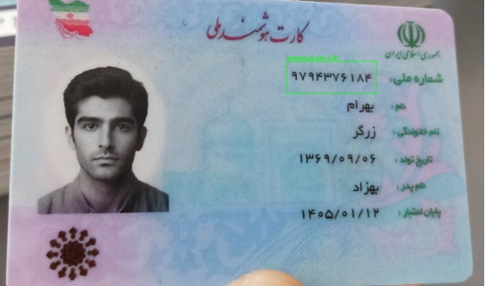
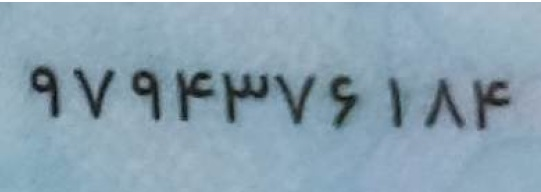

# Iranian National ID Recognition System

A robust computer vision system for extracting and validating Iranian National ID numbers from ID card images.

This project focuses on practical, real-world scenarios and is designed to work with unconstrained images captured under varying lighting conditions and orientations.

---

## Key Features

- Automatic detection of ID card and National ID region
- Orientation-aware image normalisation
- Robust digit extraction and recognition
- Confidence-based result validation
- Built-in Iranian National ID checksum verification
- Simple local application interface

---

### Dataset

This project was developed and evaluated using publicly available Iranian National ID card images.

One of the reference datasets used during development and qualitative evaluation:
https://www.kaggle.com/datasets/kibordevents/iranian-national-id-card-dataset


### Usage

This repository contains a lightweight local application.
Requirements
- Python 3.10 or newer
- Windows (Linux support planned)
  
### Run

streamlit run app.py

Or simply double-click:

run.bat

### Model Weights

Pretrained model weights are not included in this repository.

If you require access to the trained weights for evaluation or research purposes, please contact:

ce.tahmoursi@gmail.com

## Example

### Input
An image of an Iranian National ID card:


### Output

Id identification stages:



Id cropping stage:



```json
{
  code: 9794376184
  digits: [9, 7, 9, 4, 3, 7, 6, 1, 8, 4]
  confs: [1.0, 1.0, 1.0, 1.0, 1.0, 1.0, 1.0, 1.0, 1.0, 1.0]
  mean_conf: 1.0  min_conf: 1.0
  checksum_ok: False
  picked: rot0 | blur | deskew_used=True angle=1.8 | score: 3.5
}
```
